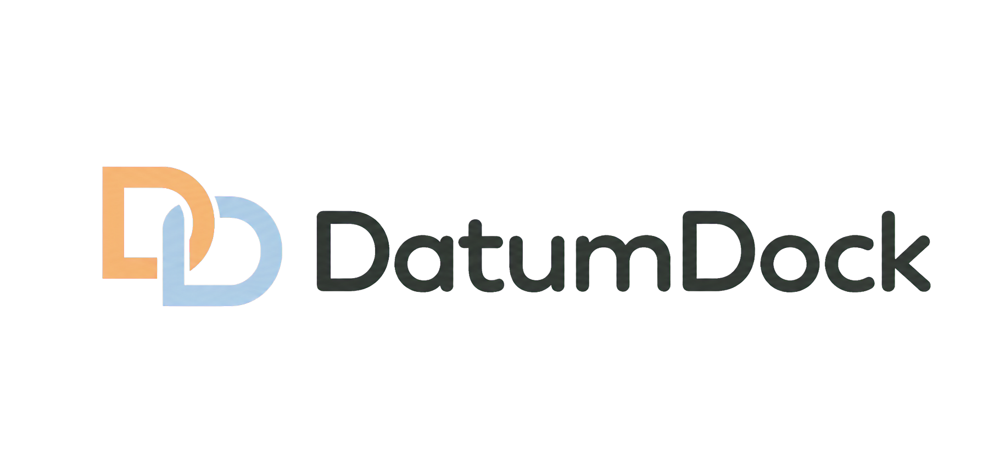

<p align="center">
  
</p>

<h1 align="center">DatumDock</h1>

<p align="center">本地优先的视觉数据集管理与标注桌面应用</p>

<p align="center">
  <a href="#当前状态">当前状态</a> ·
  <a href="#核心能力">核心能力</a> ·
  <a href="#项目文档">项目文档</a> ·
  <a href="#english-summary">English</a>
</p>

> ✅ **步骤四整改已完成**：普通模式已接入 schema v3 双状态复核、一次性矩形、两点/拖拽画框、6400% 检查、全量可配置快捷键、响应式快速标签窗和 LabelMe 立即自动保存。`--ui-preview` 仍使用关闭即丢弃的内存演示数据。模型推理、YOLO 导出、完整 X-AnyLabeling 目录互操作和备份尚未接入。

> 📝 **最新交互需求仅完成文档整理**：十字辅助线应在图片内始终跟随；移动/缩放标注时实际系统鼠标指针应切换样式；图片后方改用浅色底板，矩形工具点击或拖到底板时将坐标吸附到最近图片边缘，而不是直接失败。当前代码、测试和既有截图尚未按这些规则更新，统一修改前不得宣称完成。详见 [A0.5～A0.7 验收条目](docs/ACCEPTANCE.md#a05-十字辅助线持续跟随整改需求已锁定代码待实施)。

DatumDock 用于把分散在本地文件夹中的视觉数据，集中到安全、可追踪的数据集池中进行管理、标注、复核与导出。它的重点不只是“画框”，而是让多个独立数据集、标签体系、模型和训练导出在一个清晰的桌面工作流内协作。

> **入口与资料库已完成重构（2026-07-19）**：新 GUI 不再显示工作区、项目树或打开目录。首页以类似游戏存档的方式展示内部受管数据集，点击卡片直接进入标注工作台。完整边界见 [内部数据集主页与存档式管理方案](docs/DATASET_LIBRARY.md)。

## 当前状态

正式启动入口使用现代 PySide6 应用外壳。普通模式通过 `ManagedDatasetGateway` 访问 `%LOCALAPPDATA%\DatumDock` 内部资料库；每个数据集使用稳定 UUID 目录，显示名称不会参与路径拼接。首次启动自动建立空资料库，新建成功后直接进入真实空工作台，重启后仍可恢复卡片和元数据。

启动时会安全对账 `library.json` 与受管 UUID 目录：有效 `dataset.json` 可恢复丢失登记，损坏孤儿会保留为诊断卡片，非 UUID 目录和符号链接只报告、不跟随、不删除。现有 `library.json` 若自身损坏仍保持原字节并进入安全降级模式，不会被自动覆盖。

`python -m datumdock` 加载真实内部资料库、图片池、标签集与标注；`python -m datumdock --ui-preview` 显示完整演示状态，并持续标记“界面预览”。预览模式不会读取或修改真实资料库。普通模式可管理标签，以 `R` 一次性画框，以 `A / D` 切图，以 `S` 确认复核，使用中键/滚轮检查图片，并在设置中改绑全部应用快捷键；AI、模型、YOLO/X-AnyLabeling 目录交换与备份入口仍明确提示后续接入。

步骤四整改在独立 Python 3.11 `.venv` 中通过 Ruff、格式、`compileall`、`pytest-qt` 与完整回归：**166 passed、1 skipped**，唯一跳过仍是当前 Windows 账户缺少创建测试符号链接的权限。测试覆盖 SQLite v2→v3、JSON/SQLite 故障回滚、LabelMe 混合 shape 保序、快捷键事务、两种画框手势、6400% 坐标、快速标签窗、100 图连续保存、双数据集隔离和 10,000 条分页定位。30 张原生 Windows 截图覆盖双语、三种分辨率和整改核心页面。

## 本地运行

首选 Python 3.11 独立虚拟环境。安装 UI 与开发依赖后，使用下列命令启动：

```powershell
py -3.11 -m venv .venv
.\.venv\Scripts\Activate.ps1
python -m pip install -e ".[dev]"
python -m datumdock
```

打开完整 UI 演示：

```powershell
python -m datumdock --ui-preview
```

如果当前环境已经安装依赖但尚未执行可编辑安装，可在仓库根目录临时运行：

```powershell
$env:PYTHONPATH = "src"
python -m datumdock
```

只查看不接触真实资料库的完整 UI 演示：

```powershell
$env:PYTHONPATH = "src"
python -m datumdock --ui-preview
```

推理依赖不属于步骤四的启动前提；后续接入 ONNX/PT 时再执行 `python -m pip install -e ".[dev,inference]"`。

## 内部数据目录

普通模式默认把资料库保存在：

```text
%LOCALAPPDATA%\DatumDock
```

不要手工修改 `library.json`、数据集 UUID 目录、`dataset.json`、`label-set.json` 或 `index.sqlite`。开发和测试可临时设置 `DATUMDOCK_DATA_DIR` 指向专用绝对目录；删除测试资料时只删除自己明确指定的测试目录，不要清理真实 `%LOCALAPPDATA%\DatumDock`。

如果只需要一次性安装完整开发、推理和构建依赖，也可使用：

```powershell
python -m pip install -r requirements.txt
```

构建 Windows 分发目录和 Inno Setup 安装包的具体步骤见 [Windows 构建说明](docs/BUILD_WINDOWS.md)。

当前优先级、完成规则和验收边界分别记录在 [路线图](docs/ROADMAP.md)、[验收标准](docs/ACCEPTANCE.md) 与 [X-AnyLabeling 对标基线](docs/X_ANYLABELING_BASELINE.md)。

## 核心能力

| 领域 | 规划能力 |
| --- | --- |
| 数据集主页 | **步骤二已实现**：像游戏存档一样创建、保存、搜索、排序、打开、切换、重命名、归档和恢复多个受管数据集；不要求选择工作区或项目目录。 |
| 内置教程 | 首页提供可折叠快速开始和离线中英文学习中心，覆盖 DatumDock 全流程、YOLO Detection、数据划分/泄露与导出训练准备。 |
| 受管数据集池 | **步骤三已实现**：JPG/JPEG、PNG、BMP、WebP、TIFF 静态图复制进软件内部，经 EXIF 校正并统一转为 PNG；外部源文件不被改写。 |
| 数据质量 | **步骤三已实现**：完全重复逐项跳过/保留，近似图候选人工确认/忽略；确认组已向未来划分器提供稳定查询边界。 |
| 标注与复核 | **步骤四整改已实现**：`R` 一次性矩形支持拖拽或两点创建，完成后回到选择；支持八点缩放、列表 Delete、撤销/重做、6400% 检查和立即自动保存。图片复核只显示待复核/已完成，无标注与健康诊断独立。 |
| 快捷键 | **步骤四整改已实现**：24 个动作集中注册，支持搜索、改绑、清空、冲突替换、单项/分组/全部恢复默认和写盘失败回滚。 |
| 标签体系 | **步骤四已实现**：每个数据集独立管理英文训练名、中文别名、描述、同义词、稳定 UUID/类别 ID 与唯一颜色；支持归档、使用量、分页检查图片和训练名可恢复迁移。 |
| 自动标注 | 每个数据集可管理本地 ONNX 与受支持的 Ultralytics YOLO `.pt` 模型；优先 GPU、无 GPU 时明确回退 CPU。 |
| 模型训练导出 | 导出时自由选择比例、随机种子和目标格式；MVP 首先提供可直接训练的 YOLO Detection 目录与 `data.yaml`。 |
| 格式互操作 | 可导入 X-AnyLabeling/LabelMe 图片与同名 JSON；可导出让 X-AnyLabeling 直接打开的目录。 |
| 安全与可移植 | 数据集备份支持校验后导入；模型二进制不随备份包分发，避免无意携带大文件或执行风险。 |

## 设计理念

- **本地优先**：图片、标注和模型默认只在本机处理，不自动上传。
- **数据集先于标注**：从导入、重命名、筛选、重复图、复核、标签到训练导出形成完整闭环。
- **标签对人友好、对训练稳定**：中文别名与描述帮助快速识别，英文训练名和类别 ID 保持稳定。
- **长期使用舒适**：主页参考 Scratch 的现代友好感，标注工作台参考 X-AnyLabeling 的紧凑效率，统一使用 DatumDock 自有冷白/浅蓝灰表面、品牌蓝、圆角图标和直接反馈。
- **可审阅的 AI**：自动标注是待人工确认的建议，不会静默覆盖人工标注。

## X-AnyLabeling 互操作

DatumDock 将与 X-AnyLabeling 共用 LabelMe JSON 工作流：

- 导入含图片与同名 JSON 的目录后，矩形框可继续编辑；
- 当前不支持的多边形、旋转框、圆、线、点和扩展字段会被保留，而不是静默删除；
- 导出后生成 PNG、同名 LabelMe JSON 与 `labels.txt`，可由 X-AnyLabeling 直接打开；
- DatumDock 的内部管理信息、复核状态、模型来源等私有信息不会写进交换 JSON。

详见 [X-AnyLabeling 互操作规范](docs/X_ANYLABELING_INTEROP.md)。

## 项目文档

| 文档 | 内容 |
| --- | --- |
| [文档导航](docs/README.md) | 推荐阅读顺序、每份文档的职责与开发前检查。 |
| [内部数据集主页与存档式管理方案](docs/DATASET_LIBRARY.md) | 最新入口、软件内部存储、数据集边界、旧结构迁移与验收清单。 |
| [受管图片池说明](docs/IMAGE_POOL.md) | 导入转码、哈希与重复图、分页缩略图、重命名、回收站和崩溃恢复边界。 |
| [标注工作流说明](docs/ANNOTATION_WORKFLOW.md) | SQLite v2、标签规则、LabelMe 事实边界、自动保存、复核状态和恢复规则。 |
| [产品需求文档](docs/PRD.md) | MVP 范围、数据池、标签、模型、导出与性能要求。 |
| [架构说明](docs/ARCHITECTURE.md) | 分层、核心对象、受管存储、任务与视觉系统。 |
| [交互与界面规范](docs/UX.md) | 标注工作台四区布局、画布与页面交互。 |
| [现代视觉设计规范 v2](docs/VISUAL_DESIGN.md) | Scratch/X-AnyLabeling 参考边界、现代主题、组件、图标、动效与截图验收。 |
| [UI 与步骤四页面清单](docs/UI_INVENTORY.md) | 路由、弹窗、真实资料库/图片池/标签/标注入口、预览边界与验证结果。 |
| [UI 与步骤四交付报告](docs/UI_REVIEW.md) | 截图矩阵、验证命令、步骤四边界与自评。 |
| [路线图](docs/ROADMAP.md) | 按阶段拆分的开发任务与优先级。 |
| [验收标准](docs/ACCEPTANCE.md) | 每项功能可操作或可自动验证的完成条件。 |
| [对标基线](docs/X_ANYLABELING_BASELINE.md) | 与 X-AnyLabeling 核心工作流的分级质量目标。 |
| [互操作规范](docs/X_ANYLABELING_INTEROP.md) | X-AnyLabeling/LabelMe 导入、导出与兼容字段保留规则。 |

## 仓库结构

```text
DatumDock/
├─ .github/                 # Issue 与 Pull Request 模板
├─ assets/
│  ├─ brand/                # Logo 等品牌资产
│  └─ icons/                # 自有 UI 图标资产
├─ docs/                    # 产品、架构、交互、路线与验收文档
├─ src/                     # 应用源代码（将使用 Python/PySide6）
├─ tests/                   # 自动化测试
├─ AGENTS.md                # 面向 Codex/协作开发的项目约束
├─ CONTRIBUTING.md          # 贡献说明
└─ SECURITY.md              # 安全报告说明
```

## 参与开发

在代码初始化前，请先阅读 [贡献指南](CONTRIBUTING.md)。主要约定如下：

- 代码注释使用中文；Markdown 中文为主，同时提供英文摘要；
- 使用 Ruff 统一格式化、静态检查与 import 排序；详细规则见 [代码规范](docs/CODE_STYLE.md)；
- 不提交真实数据集、内部资料库、旧工作区、导出训练集、模型权重、密钥或缓存；
- 涉及受管数据、格式互操作、划分或 YOLO 导出的改动必须有相应测试；
- UI 复用统一设计令牌与自有图标资产，不复制第三方产品图形；
- 每完成一项功能，更新路线图并按验收标准验证。

## GitHub 发布前检查

仓库已经包含 `.gitignore`、`.gitattributes`、贡献指南、安全策略、中文/英文 Issue 模板和 PR 模板。上传到 GitHub 前，请完成以下项目：

1. 确认 [MIT 许可证](LICENSE) 符合发布意图。
2. 在 GitHub 设置仓库简介、主题标签、可见性与安全联系渠道。
3. 完成 Python 3.11、X-AnyLabeling、真实模型和隔离安装包验收后再创建 Release。
4. 首次发布后确认 README Logo、Issue 模板和默认 `main` 分支显示正常。

当前远端已绑定到 `https://github.com/xiao-pacai/DatumDock.git`；交付提交按清晰边界推送到 `main`，若网络失败会在路线图记录恢复条件，不会重写本地历史。

## 品牌资产


当前 Logo 由项目名称直接构成：浅橙色与浅蓝色交叠的 `DD` 单字母标记，搭配深炭灰 `DatumDock` 字标。它适用于 GitHub、关于页和文档；后续 Windows 应用图标将从 `DD` 标记另行导出，避免在小尺寸强行使用完整字标。资产说明见 [assets/brand/README.md](assets/brand/README.md)。

## English Summary

DatumDock is a local-first desktop application for managing and annotating computer-vision datasets. Its confirmed target experience uses a game-save-like home page backed by an app-managed dataset library: users create or open a dataset directly, without selecting a workspace or project directory, and each dataset independently owns its images, annotations, labels, models, review states, and indexes.

The main revised step-four slice is complete. Normal mode combines the managed library and image pool with schema-v3 review state, one-shot/two-click rectangles, 6400% inspection, 24 configurable actions, responsive quick label selection, ordered LabelMe persistence, immediate autosave, and label inspection. Newer documentation-only requirements add persistent crosshairs, contextual system-pointer icons, a light canvas backplate, and rectangle creation that clamps backplate input to the nearest image edge. Code and screenshots have not yet been updated for them. External source files remain unchanged, and `--ui-preview` remains isolated and disposable.

Planned MVP capabilities include an offline bilingual quick-start and tutorial center for DatumDock and YOLO; managed PNG ingestion; duplicate and similarity-group handling; rectangle annotation; image-level review states; dataset-level bilingual label management; local ONNX and supported Ultralytics YOLO model assistance; deterministic YOLO Detection export; validated dataset backups; and configurable shortcuts. Planned X-AnyLabeling/LabelMe interoperation will import directories and export directly reopenable directories while preserving unsupported shapes as compatibility payloads.

The repository uses the MIT license. Before public release, complete the checks recorded in [docs/ROADMAP.md](docs/ROADMAP.md), especially the Python 3.11 and isolated installer verification. See [CONTRIBUTING.md](CONTRIBUTING.md) for development rules and [SECURITY.md](SECURITY.md) for responsible vulnerability reporting.

The revised step-four slice passes Ruff, formatting, compilation, pytest-qt, and the full Python 3.11 suite: 166 tests pass and one symlink test is skipped because the current Windows account lacks symlink privileges. Thirty bilingual native screenshots cover 1366×768, 1440×900, 1920×1080, the workbench, shortcut settings, quick label selection, 6400% inspection, migration editing, and save-failure protection. Model inference, YOLO export, full X-AnyLabeling directory exchange, backup, and installer delivery remain future work.
