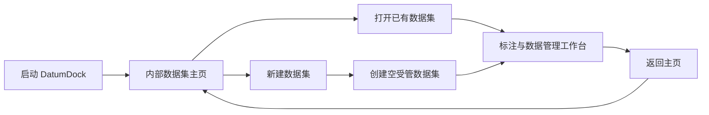

# DatumDock 内部数据集主页与存档式管理方案

> 步骤四状态（2026-07-19）：内部资料库和受管图片池基础上，SQLite v2、数据集级标签、矩形标注、LabelMe 立即自动保存与图片级复核已经实现。模型、导出、备份和旧结构迁移仍待后续步骤接入。详细边界见 [受管图片池](IMAGE_POOL.md) 与 [标注工作流](ANNOTATION_WORKFLOW.md)。

> 状态：2026-07-19 已确认产品方向；本文件仅整理需求与实现边界，当前不修改应用代码。
>
> 优先级：本方案覆盖旧文档中面向用户的“工作区 / 项目 / 数据集树 / 打开目录”入口描述。旧术语只可用于说明现有代码和迁移来源，不再代表目标产品体验。

## 1. 产品心智模型

DatumDock 应像具有多个本地存档的桌面应用，而不是像 IDE 或文件管理器。用户不需要理解工作区、项目根目录或内部文件结构，只需要管理自己的数据集：

- 启动软件后先进入 DatumDock 主页。
- 主页展示以前创建的数据集，并提供醒目的“新建数据集”入口。
- 打开已有数据集后，直接进入该数据集的标注与管理页面。
- 新建数据集完成后，也直接进入同一页面；因为还没有图片，页面展示引导式空状态。
- 图片、标注、标签、索引、模型配置、回收站与缩略图均由软件自动存放和维护。
- 用户导入外部图片时只选择来源；DatumDock 将副本复制并统一处理到内部数据集池，绝不把来源文件夹当作项目目录。

用户可见的核心对象只有“数据集”。每个数据集既是一个独立存档，也是标签、标注、图片池、模型和导出操作的完整管理单元。

## 2. 已锁定的产品决定

1. 取消面向用户的“工作区”概念，不提供“打开工作区”“选择项目目录”或类似 IDE 的入口。
2. 不要求用户指定数据集保存目录；新建数据集时由软件在内部资料库自动分配稳定 UUID 和受管目录。
3. 应用每次正常启动均进入主页，不自动跳过主页打开上次的数据集。
4. 主页必须同时提供数据集列表和“新建数据集”入口。
5. 点击已有数据集卡片直接进入标注工作台；新建成功后进入同一个空工作台。
6. 外部导入文件只作为来源，成功复制进内部池后才成为 DatumDock 样本；外部源文件不被重命名、修改或删除。
7. 数据集之间必须完全隔离。切换数据集后，不得串用图片、标签、标注、模型、复核状态或回收站记录。
8. 项目级标签集、项目级模型等旧需求调整为数据集级能力；后续若需要跨数据集共享，使用“从其他数据集复制配置”或显式合并，不恢复项目层级。
9. 正式入口已经完成步骤二重构；旧代码中的 `Workspace`、`Project` 和相关界面仅保留作后续迁移参考，不得重新暴露为用户主流程。

## 3. 术语与领域边界

| 层级 | 用户是否可见 | 目标名称 | 职责 |
| --- | --- | --- | --- |
| 软件资料库 | 否 | `AppLibrary` | 登记所有受管数据集、全局设置、最近更新时间和资料库版本。 |
| 数据集存档 | 是 | `ManagedDataset` / 数据集 | 独立拥有元数据、标签集、图片池、标注、索引、模型配置、回收站和缓存。 |
| 数据集样本 | 是 | `DatasetSample` / 图片 | 一张受管 PNG 及其标注、状态、来源摘要和派生信息。 |

后续代码重构时，`ManagedDataset` 是原先 `Project + Dataset` 的用户价值合并体，而不是简单重命名。数据集稳定 ID 使用 UUID；显示名称可以修改，但目录名和对象引用不随名称变化。

## 4. 启动与主页流程



### 4.1 首次启动

- 自动创建内部应用数据目录和空资料库索引，不弹出目录选择器。
- 展示完整 DatumDock Logo、简短产品说明、“新建数据集”主按钮、五步快速开始和学习中心；即使没有数据集，用户也可以先阅读 DatumDock 或 YOLO 教程。
- 首页视觉遵守 `docs/VISUAL_DESIGN.md`：使用现代冷白/浅蓝灰表面、品牌蓝和宽松圆角卡片，借鉴 Scratch 的亲和感但不复制其品牌。
- 设置、语言切换、关于与备份导入入口仍可从主页访问。

### 4.2 非首次启动

- 读取内部资料库索引并以卡片或舒适的网格展示数据集。
- 每张卡片至少展示：数据集名称、封面或代表缩略图、图片数量、标签数量、复核进度、最后修改时间。
- 提供数据集名称搜索和按最后修改时间、创建时间、名称排序的能力。
- 损坏或暂时不可读取的数据集不得让主页崩溃；卡片应显示异常状态并提供诊断或恢复入口。
- 数据集卡片保持主页主视觉；快速开始可折叠，学习中心位于数据集区域之后，不阻碍熟练用户快速进入已有数据集。

### 4.3 新建数据集

首版新建流程保持简洁：

1. 输入数据集名称，可选填写描述。
2. 选择“空数据集”或“从已有数据集复制配置”。复制配置可包含标签集、命名规则和导入规则，但不复制图片和标注。
3. 预检名称和内部资料库状态。
4. 原子创建目录、元数据和索引；任一步失败均回滚，不留下无法打开的半成品卡片。
5. 创建成功后直接进入空标注工作台，提示用户先管理标签或导入图片。

### 4.4 首页教程与帮助

- “快速开始”用创建数据集、配置标签、导入图片、标注/审核和导出训练数据五个步骤连接产品主流程；完成状态保存在全局设置中，可跳过、折叠并重新打开。
- “学习中心”以内置离线教程卡片提供 DatumDock 使用教程、YOLO Detection 基础、数据划分与数据泄露、导出与训练准备、X-AnyLabeling 互操作、备份恢复和常见问题。
- YOLO 内容应帮助用户理解 DatumDock 导出的文件，而不是让用户误以为应用已经包含模型训练。涉及第三方训练命令时标注适用版本并提供明确的官方外部链接入口。
- 教程阅读器支持中英文、目录、上一步/下一步、阅读进度和从教程跳转到相应功能；切换语言后保持章节与进度。
- 核心教程及必要插图随安装包提供，不依赖网络加载。教程进度只属于应用全局偏好，不进入任何数据集或备份。
- 学习中心不得展示广告、自动播放声音、强制弹窗或未经同意的远程资讯；已有数据集用户可以直接忽略教程区。

## 5. 标注与数据管理工作台

工作台保留 DatumDock 的数据集管理核心和 X-AnyLabeling 风格的高效标注体验，但不显示工作区树或项目树。

工作台视觉比主页更紧凑，使用深色画布、清晰白色信息面板和现代圆角工具按钮；不得退回默认 Qt 灰色工具栏，也不得像儿童化编辑器。

- 顶部为标题与主操作栏：DatumDock 品牌/返回主页、当前数据集下拉、导入图片、导出、标签管理、模型管理、设置与更多操作。当前数据集下拉支持搜索和快速切换，但不会打开外部目录。
- “导出”必须区分训练数据集、X-AnyLabeling 交换目录和数据集备份，不能把不同数据边界隐藏在含糊的单一“导出图片”行为里。
- 左侧为窄标注工具栏：选择/编辑、矩形框、AI 标注、平移、适配窗口、缩放、撤销与重做。AI 菜单支持当前图片、全部图片和全部未标注图片。
- 中间为占据主要空间的图片画布，负责矩形框标注、缩放、平移、选中态和直接编辑。
- 右侧上半区显示当前图片的全部标注。列表行显示标签颜色、中文别名、英文训练名和选中状态，并与画布框双向同步。
- 右侧下半区显示图片列表或网格，支持搜索和筛选。每一行/卡片显示缩略图、文件名、标注数量，并在末尾固定显示图片级状态。
- 用户可见状态至少包含“未标注、待审核、已完成、有问题、异常”。其中“已完成”等同于内部已复核；它必须由用户按整张图片确认，不能仅因存在矩形框自动产生。人工确认的无目标负样本可显示“已完成（无目标）”。
- 右侧两个区域使用可调整分隔条，可分别折叠；图片列表按 SQLite 分页并延迟加载缩略图，保证万张图片规模下可用。
- 页面标题始终明确显示当前数据集名称，避免用户误操作其他存档。
- 空数据集显示“导入图片”和“管理标签”两个首要操作，不展示无意义的空表格或 IDE 式目录提示。

详细控件位置、状态映射和交互规则以 [交互与界面规范](UX.md#1-主窗口布局) 为准。

## 6. 软件内部存储方案

“存放在软件内部”指由 DatumDock 完全管理、用户通常无需接触的应用数据目录，而不是把数据写进安装目录。Windows 安装目录可能只读，且升级或卸载时存在被替换的风险，因此默认使用当前 Windows 用户的本地应用数据位置：

```text
%LOCALAPPDATA%\DatumDock\
├─ settings.json
├─ library.json
└─ datasets\
   └─ {dataset-uuid}\
      ├─ dataset.json
      ├─ label-set.json
      ├─ index.sqlite
      ├─ pool\
      │  ├─ images\
      │  └─ annotations\
      ├─ models\
      ├─ trash\
      └─ cache\
         └─ thumbnails\
```

### 6.1 文件职责

- `settings.json`：语言、快捷键、主题、回收站阈值等全局偏好，不保存数据集内容。
- `library.json`：数据集稳定 ID、显示名称、目录登记、排序所需摘要和资料库版本。
- `dataset.json`：单个数据集的名称、描述、创建时间、版本与可迁移配置。
- `label-set.json`：该数据集完整标签定义和稳定标签 ID。
- `index.sqlite`：万级图片查询、标签关联、复核状态、相似组、任务和回收站索引。
- `pool/images`：统一转码后的受管 PNG 图片。
- `pool/annotations`：内部可交换的 LabelMe JSON 标注。
- `models`：该数据集导入的模型及其可编辑配置；数据集备份默认不包含模型二进制。
- `trash`：符合阈值的少量删除样本包，用于恢复。
- `cache/thumbnails`：由样本 UUID 与内容哈希版本命名的可重建缩略图；图片重命名不会改变缓存键。

### 6.1 启动对账与恢复规则

- `dataset.json` 是恢复主页摘要时的事实来源；`library.json` 是登记、排序和快速主页加载索引。
- 索引缺失但存在规范 UUID 目录时，启动会逐个验证目录，并从有效 `dataset.json` 原子重建登记。
- 目录已经发布、但进程在登记索引前中断时，下次启动按同一规则找回，不让数据集从主页永久消失。
- 标签文件、SQLite 或固定子目录损坏但 `dataset.json` 仍有效时，卡片保留真实名称与描述并显示诊断；`dataset.json` 也损坏时使用 UUID 派生的中立占位名称。
- 已登记摘要与有效 `dataset.json` 不一致时，以数据集元数据为准原子刷新摘要。
- 非 UUID 目录、普通文件和符号链接只写入 `LibraryRecoveryReport`，绝不跟随、删除或移动。
- 已存在但损坏的 `library.json` 不自动覆盖；应用进入安全降级模式，保留原始字节供人工诊断。
- 写盘、回滚或恢复区转移失败均转换为业务错误；错误信息同时保留原始原因和恢复失败原因，UI 不接收裸 `OSError`。
- `cache`：可安全重建的缩略图等派生数据，不作为事实来源。

### 6.2 数据安全规则

- 所有创建、导入、重命名、删除、标签迁移和备份恢复操作必须先预检，再使用临时文件、原子替换和索引事务。
- 应用升级不得清空或覆盖资料库。卸载程序默认保留用户数据；若未来提供“同时删除所有数据”，必须单独列出影响并二次确认。
- 不允许用户通过普通“打开文件夹”把任意外部目录注册成内部数据集；备份导入是迁入资料库的受控入口。
- 可在高级设置中规划“打开内部存储位置”用于诊断，但它不是日常工作流，直接手工修改后果需明确提示。
- 未来若允许迁移资料库位置，必须是带校验、可回滚的整体迁移，不能只保存一个未经验证的新路径。

## 7. 与现有需求的关系

以下既有能力继续保留，但归属由“项目或工作区”调整为“当前数据集”：

- 数据集级标签管理、颜色、别名、描述、同义词与标签检查。
- 受管图片池、完全重复检查、近似组、统一 PNG、重命名与删除。
- 矩形框标注、图片级复核状态与 X-AnyLabeling 双向互操作。
- ONNX / Ultralytics YOLO 模型管理和待复核自动标注。
- 按比例生成 YOLO 训练集，以及后续可注册的其他格式导出器。
- 数据集备份导入导出；模型二进制仍单独分享。
- 在标签集兼容时复制或移动样本、合并数据集。

“从其他数据集复制配置”替代旧的项目模板依赖。跨数据集操作必须先比较标签签名，不能通过隐藏的项目父级推断兼容性。

## 8. 旧数据模型迁移计划

当前预发布代码可能已经存在 `Workspace -> Project -> Dataset` 的对象与存储假设。正式实现本方案时应按以下顺序处理：

1. 只读扫描旧结构，生成迁移预览，不立即改写来源。
2. 将每个旧 `Dataset` 转换为独立 `ManagedDataset`；复制其所属项目的标签定义、模型配置和必要元数据。
3. 对同一项目中的多个旧数据集分别生成稳定数据集存档，不将它们偷偷合并。
4. 迁移前创建完整备份；迁移写入新临时目录并校验图片、标注、标签引用和索引数量。
5. 校验成功后登记到 `library.json`；失败时保留旧结构并输出可读报告。
6. 在确认新版本稳定前，不自动删除旧资料。

因为当前仓库仍处于预发布阶段，也可在实施前评估是否需要真实旧数据迁移；即便最终不提供迁移 UI，测试夹具仍要覆盖领域结构转换，避免静默丢失。

## 9. 后续实施顺序

1. [已完成] 冻结 `AppLibrary`、`ManagedDataset` 和内部路径解析接口，并建立不依赖 Qt 的单元测试。
2. [已完成] 实现资料库服务、数据集创建事务、重启恢复、缺失索引/孤儿目录对账与错误边界；旧结构迁移预检属于后续独立工作。
3. [已完成] 实现主页、数据集卡片、新建数据集向导和异常卡片状态。
4. [已完成] 将正式标注工作台上下文收敛为单一当前数据集；旧代码只保留作迁移参考。
5. [部分完成] 样本索引、图片池、回收站已迁入新边界；标签、模型、备份、导出和跨数据集操作待接入。
6. [部分完成] 移除正式入口中用户可见的工作区、项目树和打开目录文案；旧代码翻译键随迁移继续清理。
7. [部分完成] 重启恢复、数据隔离、100 图连续标注、10,000 条索引和步骤四 GUI 回归已验收；升级/安装包保留仍待发布阶段。

## 10. 验收清单

- [x] 首次启动不要求选择目录，并自动建立内部资料库。
- [x] 每次启动先显示包含完整 Logo、数据集列表和“新建数据集”的主页。
- [x] 新建空数据集后直接进入空标注工作台；返回主页后立即出现对应卡片。
- [x] 点击已有卡片直接进入正确数据集的标注工作台。
- [x] 重启软件后可恢复数据集卡片、元数据、配置、标签定义、图片、标注与复核状态；缺失索引与未登记 UUID 目录也可安全对账。
- [x] 中文和英文界面均不出现“打开工作区”“选择项目根目录”等过时主流程。
- [x] 导入图片会复制并转为受管 PNG，删除受管样本不会修改外部来源。
- [x] 两个数据集使用独立 UUID 目录、元数据、标签文件、索引、池、模型和回收站目录；真实样本导入、切换、任务和缓存隔离回归已通过。
- [x] 新建数据集可复制其他数据集的标签集等配置，但不复制样本、标注、缩略图、模型或回收站。
- [x] 单个数据集元数据损坏不会导致其他数据集或主页整体无法使用。
- [ ] 软件升级保留内部资料库；卸载默认不删除用户数据。
- [ ] 旧结构如需迁移，迁移过程可预览、可校验、失败可回退且不删除来源。

## 11. 待后续确认的细节

以下问题不影响本次文档定向，但应在对应实现开始前确认：

- 数据集封面默认取第一张图片、最近图片，还是允许用户指定。
- 主页删除数据集是否先进入“数据集回收站”，以及保留多久。
- 是否在高级设置提供整个内部资料库的位置迁移功能。
- [已确认] 提供“归档数据集”，归档不删除任何内容，并可从主页筛选后恢复。
- 旧预发布工作区数据是否已有真实用户数据，需要提供一次性迁移向导。

## English Summary

DatumDock step four extends the game-save-like managed library and image pool with SQLite v2 labels, editable rectangles, ordered LabelMe persistence, immediate autosave, image-level review, label inspection, and bounded recovery. Preview mode remains memory-only. Models, complete directory interchange, exports, backups, installer preservation, and legacy-data migration remain planned.
